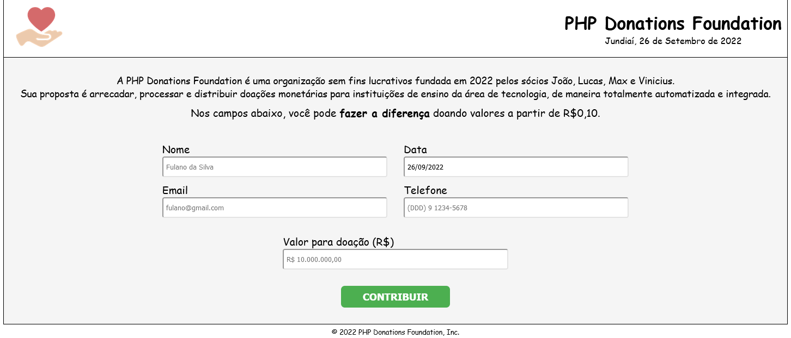
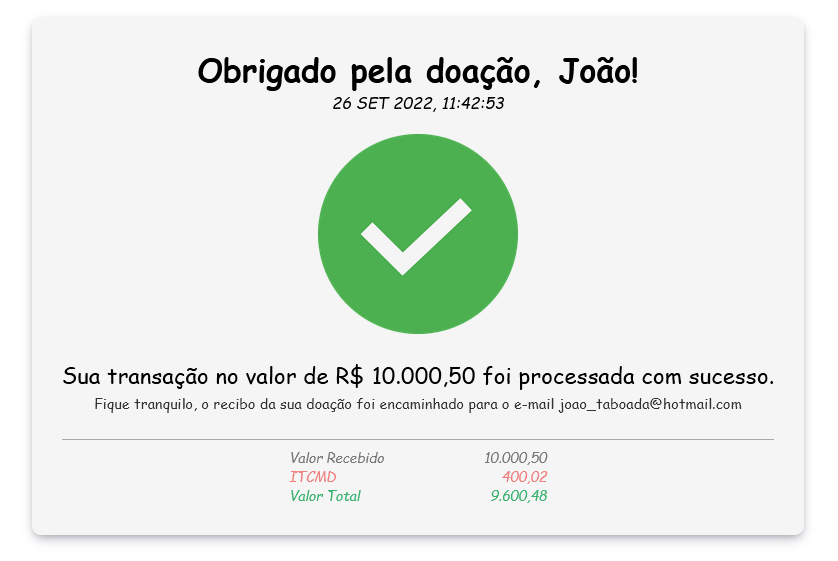

# :love_letter: PHP Donation Foundation
Página construída para a disciplina de Linguagem de Programação IV, no curso de ADS da Fatec Jundiaí. Três integrantes do grupo iniciaram com o backend em PHP e uma estrutura HTML simples, e eu fui responsável por desenvolver o frontend e finalizar o projeto.

É um site de doações para instituições de ensino de tecnologia. O usuário insere seu nome, e-mail telefone (sendo a data preenchida automaticamente) e o valor a ser doado no formulário.

 Após as validações, o usuário é transferido para a página de transação bem-sucedida, que é o recibo de pagamento.
 

  

 

## :wrench: Tecnologias utilizadas
- HTML
- CSS
- PHP 

 

## :heavy_check_mark: Funcionalidades
- Validações nos campos do formulário
- Hora e data puxadas do servidor
- Geração de arquivo texto com os dados
